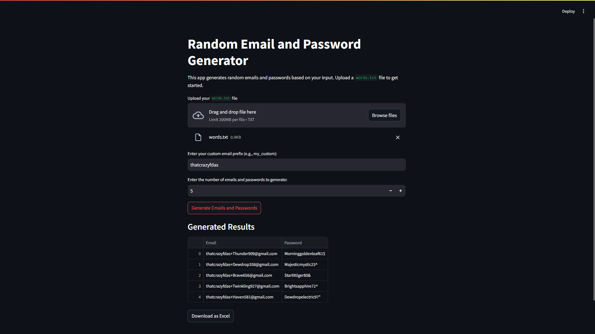

# Random Email and Password Generator by Namlucky from A26K73 (REPG_A26)

This Python-based Streamlit app generates random emails and passwords based on a user-defined word list. It provides an interactive interface to customize email prefixes, the number of entries, and supports exporting data as an Excel file. The app is hosted online using Streamlit Cloud.


---

## Features
- Custom Word List: Upload your own `words.txt` file to use meaningful words for email and password generation.
- Random Email Generation: Creates emails with a customizable prefix (e.g., `my_custom`) and random words and numbers.
- Random Password Generation: Generates secure passwords with:
  - A capitalized meaningful word (e.g., `Sunny`).
  - A lowercase meaningful word (e.g., `golden`).
  - Random numbers and special characters.
- Export Results: Download the generated data as an Excel file.

---

## Installation and Setup

### Prerequisites
- Python 3.8 or later
- Libraries listed in `requirements.txt`

### Steps to Run Locally:
1. Clone the repository:
git clone https://github.com/<your-username>/<repository-name>.git
cd <repository-name>
2. Install dependencies:
pip install -r requirements.txt
3. Run the app:
streamlit run app.py

Open the link in your browser (e.g., `http://localhost:8501`).

---

## How to Use
1. Upload `words.txt`:
- Create a file `words.txt` with one word per line (e.g., `Sunny`, `Golden`, `Silver`).
- Upload the file using the app.

2. Enter Input Fields:
- Specify the email prefix (e.g., `my_custom`).
- Enter the number of emails and passwords to generate.

3. Generate Results:
- Click "Generate Emails and Passwords" to display the outputs.

4. Download Output:
- Save the generated data as an Excel file.

---

## Project Structure

project-folder/

├── app.py # Main Streamlit application

├── requirements.txt # List of Python dependencies

├── words.txt # Example word list file

├── LICENSE # License for the project

├── README.md # Documentation and instructions

└── config.json # Configuration file (optional)

---

## Example Output

### Table Display in the App:
| Email                       | Password           |
|-----------------------------|--------------------|
| my_custom+Golden123@gmail.com | Brightmagic45@     |
| my_custom+Sunny456@gmail.com  | Silverhidden78!    |

---

## Excel Output:
When you download the generated data, it will be saved as `emails_passwords.xlsx`.

| Email                       | Password           |
|-----------------------------|--------------------|
| my_custom+Golden123@gmail.com | Magicforest34#     |
| my_custom+Silver789@gmail.com  | Glowingtiger46$    |

---

## Deployment on Streamlit Cloud

This app is deployed using Streamlit Cloud for free hosting. You can access and use the app online by visiting the following link:

## App Link: 

https://repga26.streamlit.app/

---

## Technical Details

### Dependencies
- `streamlit`: For user interface and interactivity.
- `pandas`: For data manipulation and exporting to Excel.
- `openpyxl`: For Excel file handling.

### Configuration
You can customize the app using a `config.json` file (optional)

---

# Random Email and Password Generator (Local Version)

---

## Features
- **Word List Customization**:
  Supply a `words.txt` file containing meaningful words (one word per line) to personalize email and password generation.
- **Random Email Generator**:
  Automatically generates random email addresses, such as:
  
my_custom+Golden123@gmail.com

my_custom+Sunny789@gmail.com

- **Password Generator**:
Creates secure passwords using:
- A capitalized word.
- A lowercase word.
- A random number.
- A special character.

Example:

Brightmagic47!

Silverforest28@

- **Excel Export**:
Save the generated emails and passwords as an Excel file on your desktop.

---

## Prerequisites
To run this program locally, you need:
1. **Python 3.8 or higher** installed on your computer.
2. The following Python libraries:
openpyxl

---

## Installation and Setup

### Step 1: Set Up the Environment
1. Clone this repository or download the script files into a folder on your computer.


2. Open a terminal (Command Prompt, PowerShell, or any terminal emulator).

3. Navigate to the project folder:

### Step 2: Install the Required Library
Use `pip` to install the necessary library (`openpyxl`):

### Step 3: Create the `words.txt` File
1. Open a text editor (e.g., Notepad, VS Code).
2. Create a file named `words.txt` in the EXACTLY project folder that same directory.
3. Add meaningful words, one word per line. For example:
Sunny
Golden
Silver
Magic
Bright
Bright
4. Save the file.

---

## Usage Instructions

1. **Run the Program**
- Open a terminal or Command Prompt.
- Navigate to the project folder where `app.py` is located:
  ```
  cd path\to\project-folder
  ```
- Run the program:
  ```
  python app.py
  ```

2. **Follow the Prompts**
- The program will prompt you for input:
  1. **Custom Email Prefix**:
     Enter a prefix for your emails (e.g., `my_custom`).
  2. **Number of Entries**:
     Specify how many emails and passwords to generate.
  3. **Export Filename**:
     Enter the filename to save the results as an Excel file (e.g., `output.xlsx`).

---

## Author
namlucky 
- GitHub: https://github.com/namlucky
- Email: nambluebeo@gmail.com

---
## License
This project is licensed under the PCT-EDU-VN License. See the https://pct.edu.vn for details.

---
## Contributions 
Contributions, issues, and feature requests are welcome! Feel free to open a pull request or create an issue in the repository.
